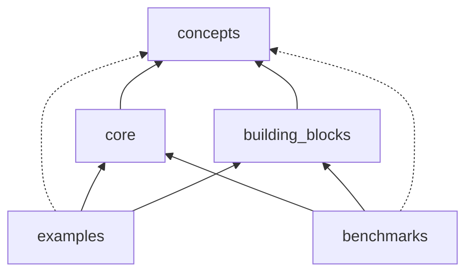

## Structure

`cellular_raza` consists of multiple crates working in tandem.
It was designed to have clear separations between conceptual choices and implementation details.
This approach allows us to have a greater amount of modularity and flexibility than regular
simulation tools.

These crates act on varying levels of abstraction to yield a fully working numerical simulation.
Since `cellular_raza` functions on different levels of abstraction, we try to indicate this in the
table below.

| crate | Abstraction Level | Purpose |
| --- | --- | --- |
| [`cellular_raza`](/docs/cellular_raza) | - | Bundle together functionality of all other crates. |
| [`concepts`](/docs/cellular_raza_concepts) | High | Collection of (mainly) traits which need to be implemented to yield a full simulation. |
| [`core`](/docs/cellular_raza_core) | Intermediate-High | Contains numerical solvers, storage handlers and more to actually solve a given system. |
| [`building_blocks`](/docs/cellular_raza_building_blocks) | Intermediate | Predefined components of cell-agents and domains which can be put together to obtain a full simulation. |
| [`examples`](https://github.com/jonaspleyer/cellular_raza/tree/master/cellular_raza-examples) | Application | [Showcases](/showcase) and introductions to different simulation approaches. |
| [`benchmarks`](/benchmarks) | Application | Performance testing of various configurations. |

## Offspring Crates & Other Contributions

During the development of `cellular_raza` multiple subfunctionalities which were only developed for
internal use have been refactored and published as individually standing crates.

| Crate | Description | Usage |
| --- | --- | --- |
| [`approx-derive`](https://crates.io/crates/approx-derive) | Derive macros for `AbsDiffEq` and `RelativeEq` of the [`approx`](https://crates.io/crates/approx) crate. | Testing |
| [`circ_buffer`](https://crates.io/crates/circ_buffer) | A `no_std` statically allocated ring-buffer with optional [`serde`](https://serde.rs) support. | Save increments for a [multistep solver](https://en.wikipedia.org/wiki/Linear_multistep_method). |
| [`crate2bib`](https://github.com/jonaspleyer/crate2bib/) | Convert crates to bibligraphy entries. | Writing texts/publishing in general. |
| [`short_default`](https://github.com/jonaspleyer/short_default) | Use shorthand notation for creating structs with default values. | See [`cr_bayesian_optim`](https://github.com/jonaspleyer/cr_bayesian_optim) |
| [`spatial-decomposition`](https://github.com/jonaspleyer/spatial-decomposition) | Split apart `2D` simulation domains such that they can be processed in parallel. | Experimental usage in [`CartesianCuboid2D`](/docs/cellular_raza_building_blocks/struct.CartesianCuboid.html) |
| [`uniquevec`](https://crates.io/crates/uniquevec) | A `Vec`-like datastructure which only contains unique entries. It is `no_std` and makes no use of unsafe code. | Specify multiple [`StorageOption`](/docs/cellular_raza_core/storage/enum.StorageOption.html) in correct priority without duplicates. |

Furthermore, contributions to the following projects have been made:
[`pyo3`](https://github.com/PyO3/pyo3)
[`rust-numpy`](https://github.com/PyO3/rust-numpy)
[`plotters`](https://github.com/plotters-rs/plotters)
[`servo`](https://github.com/servo/servo)
[`typst`](https://github.com/typst/packages)

## Development

<video src="/internals/cellular_raza-development-gource.mp4" controls style="width: minmax(100%, 1280px);">
</video>


