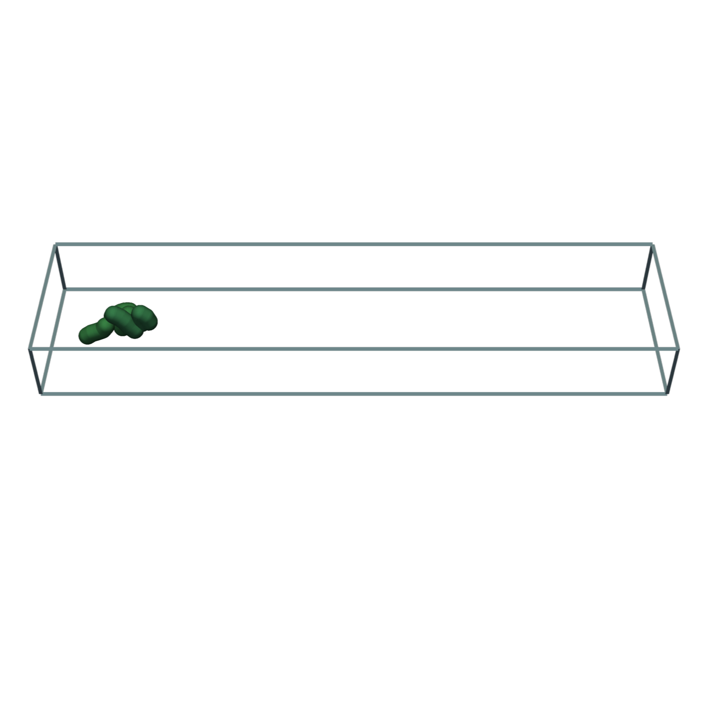
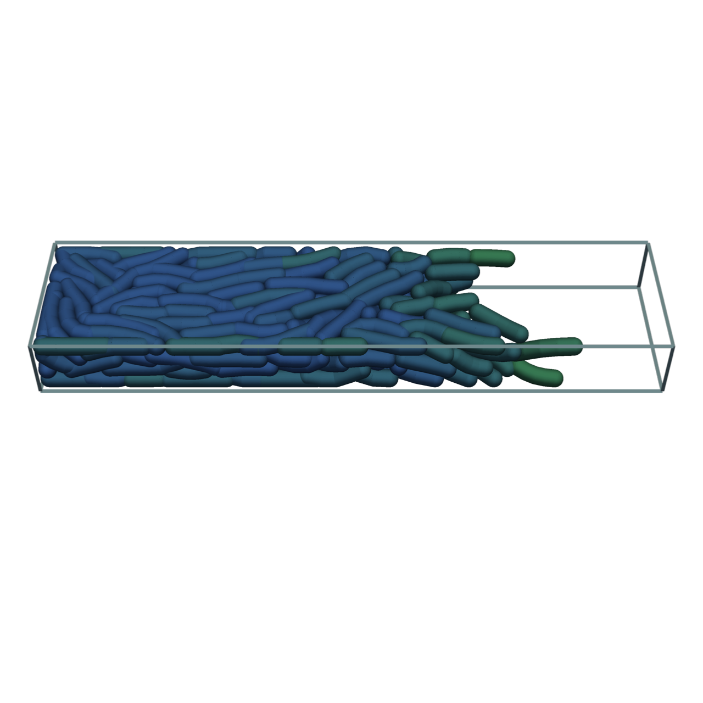
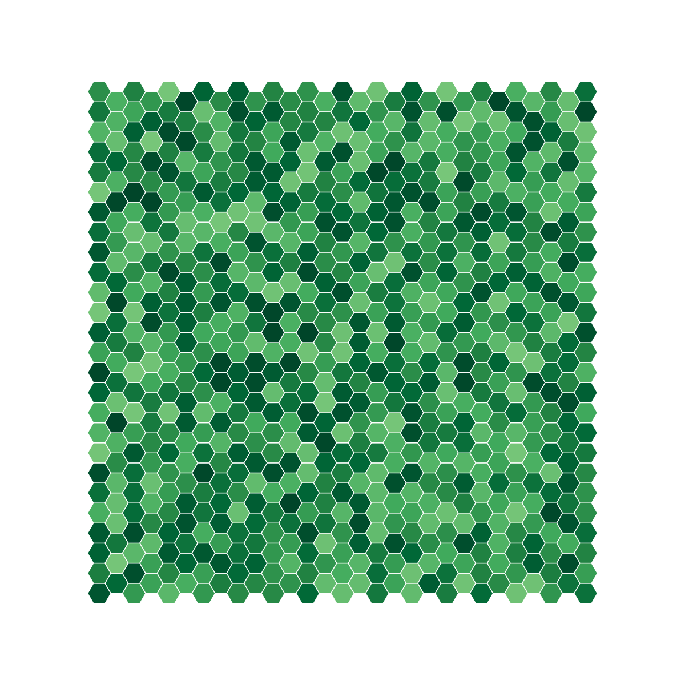
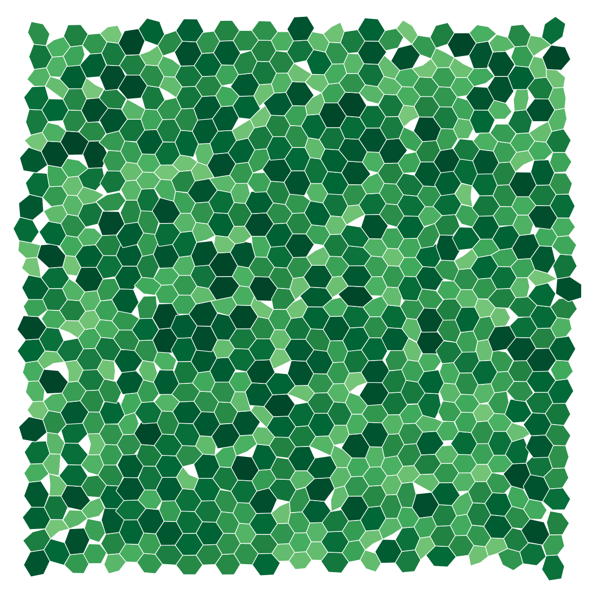

# Summary

`cellular_raza` is a library that allows users to define fully-customized cellular agents in order
to run numerical simulations.
It formulates simulation aspects in the form of rust traits.
The cellular agents and simulation domain implement a subset of these simulation aspects and
`cellular_raza` provides generic methods to numerically solve the system and store results.
It also comes with predefined building blocks for agents and their physical domain to quickly
construct new simulations bottom-up.
Furthermore, `cellular_raza` has been used with the `pyo3` and `maturin` packages to create python
bindings and can act as a numerical backend to a python package.

# Statement of need

Agent-based models are common in cellular biology and many tools have been developed so far
to asses specific questions in specialized fields [@Pleyer2023].
While these tools have proven to be effective for targeted research questions,
they often lack the ability to be applied for multiple distinct use-cases in a more generic context.
However, core functionalities such as numerical solvers, storage solutions, domain decomposition
methods and functions to construct these simulations could be shared between models if written in
a generic fashion.

In order to combat this issue and build up models from first principles without any assumptions on
the underlying complexity or abstraction level, we developed `cellular_raza`.

- *TODO CITATIONS*

# State of field
## Generic agent-based modelling toolkits
There exists a wide variety of many general-purpose agent-based simulation toolkits which are being
actively applied in a different fields of study [@Abar2017; @Datseries2022; @Wilensky:1999].
These tools are often able to define agents bottom-up and can be a good choice if they allow for the
desired cellular representation.
However, they lack the explicit forethough to be applied in cellular systems and often implement
global rules rather than individual-based ones.
Furthermore, since they are required to solve a wider range of problems they are not able to make
assumptions on the type of agent or the nature of their interactions and thus miss out on possible
performance optimizations.

## Cellular agent-based frameworks
In our previous efforts [@Pleyer2023] we have assessed the overall state of modelling toolkits for
individual-based cellular simulations.
In this mini-review, we focussed on agent-based modelling frameworks, which provide a complete
workflow.
The inspected frameworks are all crafted for specific use-cases
and may require a large amount of parameters specific to their domain of usage.
These parameters are often not known in practice and are hard to determine experimentally.
This creates problems for the extendability of the software and the ability to properly interpret
results.

We can further reduce the number of modeling frameworks by only considering ones which provide a
significant level of flexibility and customizability in their definition of cell-agents.
Chaste [@Cooper2020] allows to reuse individual components of their simulation code such as ODE
and PDE solvers.
Biocellion [@Kang2014] has support for different cell shapes such as spheres and cylinders but
acknowledges that their current approach lacks flexibility in the subcellular description.

- *TODO check which other frameworks to consider*

# Underlying Assumptions and Internals

## List of Simulation Aspects

| Aspect | Description | Depends on |
| --- | --- | --- |
| **Cellular Agent** | | |
| `Position` | Spatial representation of the cell | |
| `Velocity` | Spatial velocity of the cell | |
| `Mechanics` | Calculates the next increment from given force, velocity and position. | `Position` and `Velocity` |
| `Interaction` | Calculates force acting between agents. Also reacts to neighbours. | `Position` and `Velocity` |
| `Cycle` | Changes core properties of the cell. Responsible for cell-division and death. | |
| `Intracellular` | Intracellular representation of the cell. | |
| `Reactions` | Intracellular reactions | `Intracellular` |
| `ReactionsExtra` | Couples intra- & extracellular reactions | `DomainReactions` |
| `ReactionsContact` | Models reactions between cells purely by contact | `Position`, `Intracellular` |
| **Simulation Domain** | | |
| `Domain` | Represents the physical simulation domain. | |
| `DomainMechanics` | Apply boundary conditions to agents. | `Position`, `Velocity` |
| `DomainForce` | Apply a spatially-dependent force onto the cell. | `Mechanics` |
| `DomainReactions` | Calculate extracellular reactions and effects such as diffusion. | `ReactionsExtra` |
| **Other** | | |
| `Controller` | Externally apply changes to the cells. | |

## Spatially Localized Interactions

One of the most fundamental assumptions within `cellular_raza` is that each and every interaction is
of finite range.
This means that cellular agents only interact with their nearest neighbour and close environment.
Any long-ranged interactions must be the result of a collection of short-ranged interactions.
This assumption enables us to split the simulation domain into chunks and process them individually
although some communication is needed in order to deal with boundary conditions.
In practice, this means that any interaction force should be given a cutoff.
It also means that any interactions which need to be evaluated between agents should in theory scale
linearly with the number of agents $\mathcal{O}(n_\text{agents})$.

## Code Structure

`cellular_raza` consists of multiple crates working in tandem.
It was designed to have clear separations between conceptual choices and implementation details.
This approach allows us to have a greater amount of modularity and flexibility than regular
simulation tools.

These crates act on varying levels of abstraction to yield a fully working numerical simulation.
Since `cellular_raza` functions on different levels of abstraction, we try to indicate this in the
table below.

| crate | Abstraction Level | Purpose |
| --- | --- | --- |
| `cellular_raza` | - | Bundle together functionality of all other crates. |
| `concepts` | High | Collection of (mainly) traits which need to be implemented to yield a full simulation. |
| `core` | Intermediate-High | Contains numerical solvers, storage handlers and more to actually solve a given system. |
| `building_blocks` | Intermediate | Predefined components of cell-agents and domains which can be put together to obtain a full simulation. |
| `examples` | Application | Showcases and introductions to different simulation approaches. |
| `benchmarks` | Application | Performance testing of various configurations. |

## Backends

To numerically solve a fully specified system, `cellular_raza` provides backends.
The functionality offered by a backend is the most important factor in determining the workflow of
the user and how a given simulation is executed.
Currently, we provide the default `chili` backend but hope to extend this collection in the future.
Backends may choose to purposefully restrict themselves to a subset of simulation aspects or a
particular implementation in order to improve performance.

### Chili

The `chili` backend is the default choice for any new simulation.
It generates source code by extensively using
[macros](https://doc.rust-lang.org/reference/macros-by-example.html) and
[generics](https://doc.rust-lang.org/reference/items/generics.html).
Afterwards, the generated code is compiled and run.

Every backend function is implemented generically by hand.
We use [trait bounds](https://doc.rust-lang.org/rust-by-example/generics/bounds.html) to enforce
correct usage of every involved type.
The generated code is restricted to methods of structs and derivations of their components
functionality.
To obatin a fully working simulation, the `chili` backend combines these generic methods with
user-provided and generated types.
The `run_simulation!` macro generates code depending on which type of simulation aspect is activated
by the user.
By employing this combined scheme of generics and macros, we leverage the strong type-system and
Rusts language-specific safety to avoid pitfalls which a purely macro-based approach would yield.

### Other Backends

`cellular_raza` also comes with the `cpu_os_threads` backend which was the first backend created.
It is in the midst of being deprecated and only serves for some legacy usecases.
In the future, we hope to add a dedicated backend named `cara` to leverage GPU-accelerated
(Graphical Processing Unit) algorithms.

# Examples

All presented examples with more in-depth descriptions as well as the used code can be viewed at
[cellular-raza.com/showcase](https://cellular-raza.com/showcase).

## Cell Sorting

Cell sorting is a naturally occurring phenomenon which drives many biological processes [@Steinberg1963; @Graner1992].
While the underlying biological reality can be quite complex, it is rather simple to describe such
a system in its most basic form.
The responsible principle is that the `Interaction` between cells are specific to their species.
In our example, we consider two distinct species represented by soft spheres which physically
attract each other at close proximity if their species is identical.

We initially place cells randomly inside a cube with reflective boundary conditions.
In the final snapshot, we can clearly see the phase-separation between the different species.

{ width=50% }
{ width=50% }
\begin{figure}[!h]
    \centering
    \caption{
        The initial random placement of cells reorders into a phase-separated spatial pattern.
    }
\end{figure}

## Bacterial Rods

Bacteria come in various forms [@Zapun2008; @Young2006] such an elongated shape [@Billaudeau2017] which grows asymmetrically in the direction of elongation during the growth phase of the cell.
To model this behaviour, we describe the physical `Mechanics` of one cell as a collection of
multiple vertices $\vec{v}_i$ which are connected by edges.
The edges are modelled as springs and their relative angle at each connecting vertex introduces a
stiffening force which is proportional to the angle difference $\alpha-180°$.
The `Interaction` of two cells is implemented via a force potential which acts between every vertex
and the closest point on the other cells edges.
The potential that of a soft-sphere with a short-ranged adherent force.

In addition, the cell `Cycle` introduces growth of the bacteria until it reaches a threshold and
divides in the middle into two new cells.
The growth is downregulated by an increasing number of neighboring cells.
This can also be accomplished by the `Interaction` simulation aspect.
It is an phenomenological but effective choice to model the gradual transition into the stationary
phase of the bacterial colony.

Initially, the cells are placed inside the left-hand side of an elongated box with
reflective boundary conditions.
The cells are colored continuously from green for fast growth to blue for dormant cells.

{ width=50% }
{ width=50% }
\begin{figure}[!h]
    \centering
    \caption{
        The bacteria extend from the initial placement in the left side towards the right side.
        Their elongated shape and the confined space favour the orientation facing along the growth
        direction.
    }
\end{figure}

## Branching of _Bacillus Subtilis_
Spatio-temporal patterns of bacterial growth such as in _Bacillus Subtilis_ have been studied for
numerous years [@kawasakiModelingSpatioTemporalPatterns1997; @matsushitaInterfaceGrowthPattern1998].
They are typically described by a system of PDEs (Partial Differential Equations) which contain
non-spatial and spatial contributions.
describing intracellular reactions and cell-cycle and spatial
contributions (typically via Diffusion processes) which describe diffusion of nutrients and
movement of the cells.

With `cellular_raza` we can clearly distinguish between these simulation aspects.
We describe the `Mechanics` and physical `Interaction` of the cells as soft spheres.
Extracellular reactions (`DomainReactions`) in the simulation domain are modeled by Diffusion
which is coupled via an uptake term (`ReactionsExtra`) to the cells intracellular `Reactions`.
During its life `Cycle`, the cell grows continuously and divides upon reaching a threshold.

The initial placement of the cells is inside of a centered square.
From there, cells start consuming nutrients and growing outwards towards the nutrient-rich area.
Cells are colored bright purple while they are actively growing and dividing while dark cells are
not subject to growth anymore.
The outer domain is colored by the intensity of present nutrients.
A lighter color indicates that more nutrients are available while a dark color signifies a lack
thereof.
The two snapshots show the state after 28% of the total simulation time and at the final simulation
step.
The diffusivity of the nutrient and the growth rate of the bacteria are the governing criteria for
the shape of the pattern.

{ width=50% }
{ width=50% }
\begin{figure}[!h]
    \centering
    \caption{
        The bacterial colony grows outwards towards the nutrient-rich parts of the domain thus
        forming branches in the process.
    }
\end{figure}

## Semi-Vertex Model for Epithelial and Plant Cells

Vertex models are a very popular choice in describing multicellular systems.
They are actively being used in great variety such as to describe mechanical properties of plant
cells [@Merks2011] or organoid structures of epithelial cells [@Fletcher2014; @Barton2017].

This model represents cells as a polygonal collection of vertices which are connected by springs.
In addition, an inside pressure pushes vertices outwards of the cell until the desired total cell
area is achieved.
These mechanisms by themselves create perfect hexagonal cells.
The cell itself is able to move around freely but interacts via an attractive force with other
cells.
In the case that two polygons overlap, a repulsive force acts between them.
The interacting forces can lead to deviations in the otherwise perfect hexagonal shape.

{ width=50% }
{ width=50% }
\begin{figure}[!h]
    \caption{
        Cells are placed in a perfect hexagonal grid such that edges and vertices align.
        Their growth rates are chosen from a uniform distribution.
        During growth they push on each other thus creating small spaces in between them as the
        collection expands.
    }
\end{figure}

# Performance

We present two separate performance benchmarks assessing the computational efficacy of our code.
The interested reader can find more details in the documentation under
[cellular-raza.com/benchmarks/2024-07-sim-size-scaling](https://cellular-raza.com/benchmarks/2024-07-sim-size-scaling).

## Multithreading
One measure of multithreaded performance is to calculate the possible theoretical speedup
given by Amdahl's law [@Rodgers1985] $T(n)$ and its upper limit $S=1/(1-p)$

\begin{align}
    T(n) &= T_0\frac{1}{(1-p) + \frac{p}{n}}
    \label{eq:amdahls-law}
\end{align}

where $n$ is the number of used parallel threads and $p$ is the proportion of execution time which
benefits from parallelization.

Measuring the performance of any simulation will be highly dependent on the specific cellular 
properties and complexity.
We chose the cell sorting example which contains minimal complexity in terms of calculating
interaction between cellular agents.
Any computational overhead which is intrinsic to `cellular_raza` and not related to the chosen
example would thus be more likely to manifest in performance results.
The total runtime of the simulation is of no relevance since we are only concerned with relative
speedup upon using additional resources.
In addition, we fixed the frequency of each processor, to account for power-dependent effects.

This benchmark was run on three distinct hardware configurations.
We fit equation \autoref{eq:amdahls-law} and obtain the parameter $p$ from which the theoretical
maximal speedup $S$ can be calculated.

Thus we obtain the values $S_\text{3700X}=13.64$, $S_\text{3960X}=45.05$ and
$S_\text{12700H}=34.72$.

## Scaling of Simulation Size

Since we consider only locally finite interactions between agents, we are able to make optimizations
which lead to a linear instead of quadratic scaling in the case of fixed-density.
We set out to test this hypothesis and measure the numerical complexity of calculating interactions
between increasing cellular agents.
To do so, we again chose the cell-sorting example for its minimal intrinsic computational overhead
and gradually increased the number of cellular agents and domain size while keeping their density
constant.
Afterwards, we fit the resulting datapoints with a quadratic formula.
It is easily recognizable that the observed scaling agrees with the expected results.

\begin{figure}
    \begin{minipage}{0.5\textwidth}
        \includegraphics{figures/thread_scaling.png}
        \caption{Amdahl's law with increasing amounts of CPU resources.}
        \label{fig:thread-scaling}
    \end{minipage}%
    \begin{minipage}{0.5\textwidth}
        \includegraphics{figures/sim-size-scaling.png}
        \caption{Scaling of the total simulation size.}
    \end{minipage}
\end{figure}

# Discussion

We have shown that `cellular_raza` can be applied in a wide variety of contexts.
It can also serve as a numerical backend for the development of python packages.
We have assessed the multithreaded performance of the implemented algorithms and shown that
sufficiently large simulations can be efficiently parallelized on various machines.
The underlying assumptions predict a linear growth in computational demand with linearly growing
problem size which has been confirmed by our analysis.

<!-- Single dollars ($) are required for inline mathematics e.g. $f(x) = e^{\pi/x}$

Double dollars make self-standing equations:

$\Theta(x) = \left\{\begin{array}{l}
0\textrm{ if } x < 0\cr
1\textrm{ else}
\end{array}\right.$

You can also use plain \LaTeX for equations
\begin{equation}\label{eq:fourier}
\hat f(\omega) = \int_{-\infty}^{\infty} f(x) e^{i\omega x} dx
\end{equation}
and refer to \autoref{eq:fourier} from text.-->

<!-- # Citations -->

<!-- Citations to entries in paper.bib should be in
[rMarkdown](http://rmarkdown.rstudio.com/authoring_bibliographies_and_citations.html)
format.

If you want to cite a software repository URL (e.g. something on GitHub without a preferred
citation) then you can do it with the example BibTeX entry below for @fidgit.

For a quick reference, the following citation commands can be used:
- `@author:2001`  ->  "Author et al. (2001)"
- `[@author:2001]` -> "(Author et al., 2001)"
- `[@author1:2001; @author2:2001]` -> "(Author1 et al., 2001; Author2 et al., 2002)"

# Figures

Figures can be included like this:

and referenced from text using \autoref{fig:example}.

Figure sizes can be customized by adding an optional second parameter:
{ width=20% }-->

# Acknowledgements

# References

