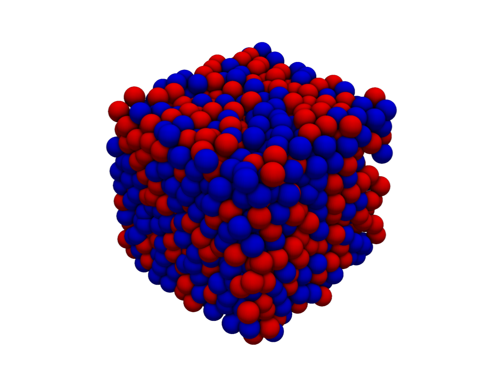
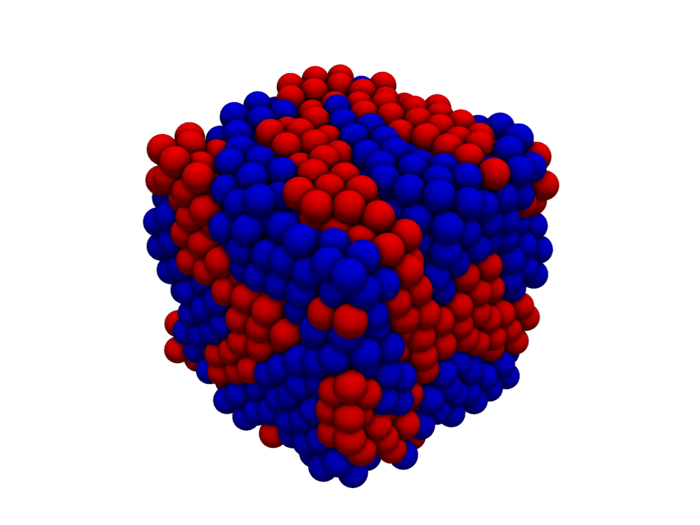
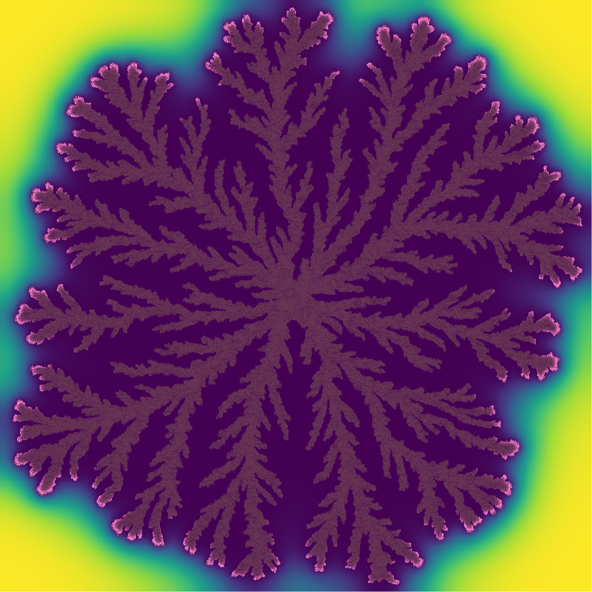
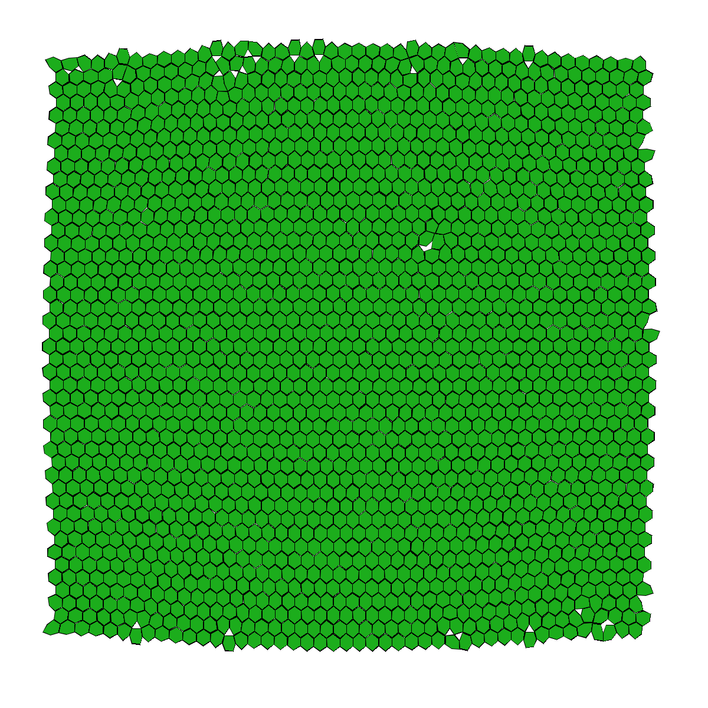
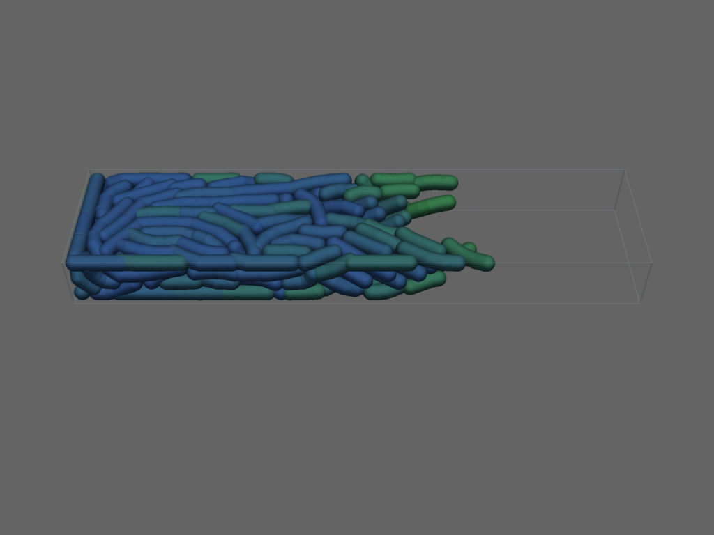
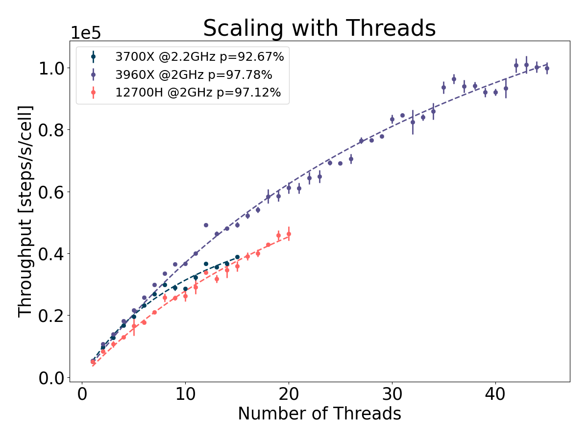
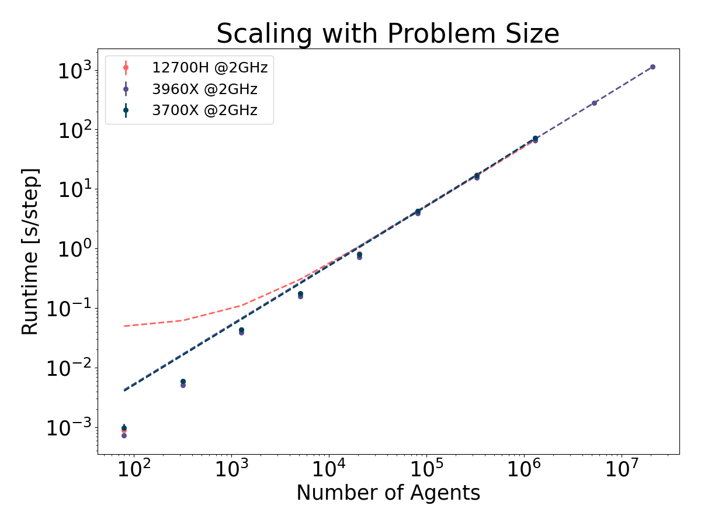

# Summary

# Statement of need

Agent-based models are common in cellular biology and many tools have been developed so far
to asses specific questions in specialized fields [@Pleyer2023].
While these tools have proven to be effective in their specialized field,
they often lack the ability to be applied in a more generic context.
In order to combat this issue and build up models from first principles without any assumptions on
the complexity or underlying abstraction level of the model, we developed `cellular_raza`.

# State of field
## Generic agent-based modelling toolkits
There exists a wide variety of many general-purpose agent-based simulation toolkits which are being
actively applied in a different fields of study [@Abar2017].
These tools are often able to define agents bottom-up and can be a good choice if they allow for the
desired cellular representation.
However, they lack the explicit forethough to be applied in cellular systems and often implement
global rules rather than individual-based ones.

## Cellular agent-based frameworks
In our previous efforts [@Pleyer2023] we have assessed the overall state of modelling toolkits for
individual-based cellular simulations.
In this mini-review, we focussed on modelling frameworks, which provide a complete workflow.
The resulting frameworks are all crafted for specific use-cases
and thus lack extendability and may require a large amount of parameters specific to their domain
of usage but which are often not known in practice.
This creates a cost in terms of parameters and the ability to interpret results.

We can further reduce this number by only investigating frameworks which provide a significant level
of flexibility and customizability in their definition of cell-agents.
Chaste allows to reuse individual components of their simulation code such as ODE and PDE solvers.
Biocellion has support for different cell shapes such as spheres and cylinders but acknowledge
that their current approach lacks flexibility in subcellular description.

# Internals
## Code Structure

`cellular_raza` consists of multiple crates working in tandem.
It was designed to have clear separations between conceptual choices and implementation details.
This approach allows us to have a greater amount of modularity and flexibility than regular
simulation tools.

These crates act on varying levels of abstraction to yield a fully working numerical simulation.
Since `cellular_raza` functions on different levels of abstraction, we try to indicate this in the
table below.

| crate | Abstraction Level | Purpose |
| --- | --- | --- |
| `cellular_raza` | - | Bundle together functionality of all other crates. |
| `concepts` | High | Collection of (mainly) traits which need to be implemented to yield a full simulation. |
| `core` | Intermediate-High | Contains numerical solvers, storage handlers and more to actually solve a given system. |
| `building_blocks` | Intermediate | Predefined components of cell-agents and domains which can be put together to obtain a full simulation. |
| `examples` | Application | Showcases and introductions to different simulation approaches. |
| `benchmarke` | Application | Performance testing of various configurations. |

## Backends

To numerically solve a fully specified system, `cellular_raza` provides backends.
The [chili](chili) backend is the default backend while the [cpu-os-threads](cpu-os-threads)
backend was the first backend which is being phased out gradually at the moment.

The functionality offered by a backend is the most important factor in determining the workflow of
the user and how a given simulation is executed.
Currently, we provide the default `chili` backend but hope to extend this collection in the future.

### Chili

The `chili` backend generates source code by extensively using
[macros](https://doc.rust-lang.org/reference/macros-by-example.html) and
[generics](https://doc.rust-lang.org/reference/items/generics.html).
Afterwards, the generated code is compiled and run.

Every backend function is implemented generically by hand.
We use trait bounds to enforce correct usage of every involved type.
The generated code is restricted to structs and derivations of their components functionality.
To obatin a fully working simulation, the `chili` backend combines these generic methods,
user-provided and generated types.
By employing this scheme, we leverage the strong type-system and Rusts language-specific safety to
avoid pitfalls which a purely macro-based approach would yield.

### Other Backends
`cellular_raza` also comes with the `cpu_os_threads` backend which is in the midst of being
deprecated and only serves for some legacy usecases.
In the future, we hope to add a dedicated backend named `cara` for solving on the GPU
(Graphical Processing Unit).

<!-- 1. Code Generation
    1. Derive macros
    2. Main run macros
    3. Templating
2. Compilation
    1. Rust compiler compatibility checking
    2. LLVM Optimization
    3. Static dispatch (generics)
3. Execution
    1. Save points
    2. Parallelization
    3. Sender-Receiver Channels
    4. Update Steps
        1. Step 1 (Mechanics Exchange Information)
        2. Step 2 (Mechanics Calculate Forces)
        3. Step 3 (Mechanics Update + Send Cells)
        4. Step 4 (Mechanics Receive Cells)
-->

# Underlying Assumptions
## Spatially Localized Interactions
One of the most fundamental assumptions within `cellular_raza` is that each and every interaction is
of finite range.
This means that cellular agents only interact with their nearest neighbour and close environment.
Any long-ranged interactions must be the result of a collection of short-ranged interactions.
This assumption enables us to split the simulation domain into chunks and process them individually
although some communication is needed in order to deal with boundary conditions.
In practice, this means that any interaction force should be given a cutoff.
It also means that any interactions which need to be evaluated between agents should in theory scale
linearly with the number of agents $\mathcal{O}(n_\text{agents})$.

# Examples
## Cell Sorting
Cell Sorting is a naturally occurring phenomenon which drives many biological processes.
While the underlying biological reality can be quite complex, it is rather simple to describe such
a system in its most basic form.
The underlying principle is that interactions between cells are specific.

## Mathematical Description

We assume that cells are spherical objects which interact via force potentials.

\begin{align}
    \sigma &= \frac{r}{R_i + R_j}\\
    V(r) &= V_0 \left(\frac{1}{3\sigma^3} - \frac{1}{\sigma}\right)
\end{align}

The values $R_i,R_j$ are the radii of the cells ($i\neq j$) interacting with each other.
For simplification, we can assume that they are identical $R_i=R_j=R$.

Furthermore, we assume that the equation of motion is given by

\begin{equation}
    \partial^2_t x = F - \lambda \partial_t x
\end{equation}

where the first term is the usual force term $F = - \nabla V$ obtained by differentiating the
given potential and the second term is a damping term which arises due to the cells being immersed
inside a viscuous fluid.


Note that we opted to omit the mass factor on the left-hand side of the previous equation.
This means, that units of $V_0$ and $\lambda$ are changing and they incorporate this property.


We can assume that interactions between cells are restricted to close ranges and thus enforce a
cutoff $\xi$ for the interaction where the resulting force is identical to zero.

\begin{equation}
    V(r) = \begin{cases}
        V_0 \left(\frac{1}{3\sigma^3} - \frac{1}{\sigma}\right) &\text{ if } r \leq \xi \\
        0 &\text{ else }
    \end{cases}
\end{equation}

We further assume that cells of different species do not attract each other.
To describe this behaviour, we set $V(r)=0$ when $r>R_i+R_j$ and both cells have distince species
type.

{ width=50% }
{ width=50% }

## Bacterial Branching
To model the spatial mechanics of elongated bacteria, we represent them as a collection of
auxiliary vertices $\{\vec{v}_i\}$ which are connected by springs in ascending order.
Furthermore, we assume that the cells are flexible described by their stiffness property.
A force $\vec{F}$ interacting between cellular agents determines the radius (thickness) of the
rods and an attractive component can model adhesion between cells.

### Mechanics
In principle we can assign individual lengths $\{l_i\}$ and strengths $\{\gamma\}_i$ to each
spring.
The internal force acting on vertex $\vec{v}_i$ can be divided into 2 contributions coming from
the 2 springs pulling on it.
In the case when $i=0,N_\text{vertices}$, this is reduced to only one internal component.
We denote with $\vec{c}_{i}$ the connection between two vertices
\begin{align}
    \vec{c}_i = \vec{v}_{i}-\vec{v}_{i-1}
\end{align}
and can write down the resulting force
\begin{align}
    \vec{F}_{i,\text{springs}} =
        &-\gamma_i\left(1 - \frac{l_i}{\left|\vec{c}_i\right|}\right)
        \vec{c}_i\\
        &+ \gamma_{i+1}\left(1 - \frac{l_{i+1}}{\left|\vec{c}_{i+1}\right|}\right)
        \vec{c}_{i+1}
\end{align}

In addition to springs between individual vertices $\vec{v}_i$, we assume that each angle at a
vertex between two other is subject to a stiffening force.
Assuming that $\alpha_i$ is the angle between the connections and
$\vec{d}_i=\vec{c}_i/|\vec{c}_i|$ is the normalized connection,
we can write down the forces acting on vertices $\vec{v}_i,\vec{v}_{i-1},\vec{v}_{i+1}$
\begin{align}
    \vec{F}_{i,\text{stiffness}} &= \eta_i\left(\pi-\alpha_i\right)
        \frac{\vec{d}_i - \vec{d}_{i+1}}{|\vec{d}_i-\vec{d}_{i+1}|}\\
    \vec{F}_{i-1,\text{stiffness}} &= -\frac{1}{2}\vec{F}_{i,\text{stiffness}}\\
    \vec{F}_{i+1,\text{stiffness}} &= -\frac{1}{2}\vec{F}_{i,\text{stiffness}}
\end{align}
where $\eta_i$ is the angle stiffness at vertex $\vec{v}_i$.
We can see that the stiffening force does not move the overall center of the cell in space.
The total force is the sum of external and internal forces.
$\begin{equation}
    \vec{F}_{i,\text{total}} = \vec{F}_{i,\text{springs}}+ \vec{F}_{i,\text{stiffness}} + \vec{F}_{i,\text{external}}
\end{equation}$
and are integrated via
\begin{align}
    \partial_t^2 \vec{x} &= \partial\vec{x} + D\vec{\xi}\\
    \partial_t\vec{x} &= \vec{F}_\text{total}
\end{align}
where $D$ is the diffusion constant and  $\vec{\xi}$ is the wiener process (compare with
[brownian motion](/docs/cellular_raza_building_blocks/struct.Brownian3D.html)).

<!--
### Interaction
When calculating forces acting between the cells, we can use a simplified model to circumvent the
numerically expensive integration over the complete length of the rod.
Given a vertex $\vec{v}_i$ on one cell, we calculate the closest point $\vec{p}$ on the polygonal
line given by the vertices $\{\vec{w}_j\}$ of the interacting cell.
Furthermore we determine the value $q\in[0,1]$ such that
$\begin{equation}
    \vec{p} = (1-q)\vec{w}_j + q\vec{w}_{j+1}
\end{equation}$
for some specific $j$.
The force is then calculated between the points $\vec{v}_i$ and $\vec{p}_i$ and acts on the
vertex $\vec{w}_i,\vec{w}_{i+1}$ with relative strength $(1-q)$ and $q$.
\begin{align}
    \vec{F}_{i,\text{External}} = \vec{F}(\vec{v}_i,\vec{p})
\end{align}
For this example, we reused the interaction shape of the [cell-sorting](/showcase/cell-sorting)
example ignoring the species aspect.

### Cycle
To simulate proliferation, we introduce a growth term for the spring lengths $l_i$
$\begin{equation}
    \partial_t l_i = \mu
\end{equation}$
which will increase the length of the cell indefenitely unless we impose a condition for the
[division event](/internals/concepts/cell/cycle).
We define a threshold (in our case double of the original length) for the total length of the
cell at which it divides.
To construct a new cell, we cannot simply copy the existing one twice, but we also need to adjust
internal parameters in the process.
The following actions need to be taken for the old and new agent.

1. Assign a new growth rate (pick randomly from uniform distribution in $[0.8\mu_0,1.2\mu_0]$
   where $\mu_0$ is some fixed value)
2. Assign new positions
    1. Calculate new spring lengths
    $\tilde{l}_i = l_i\left(\frac{1}{2} - \frac{r}{\sum\limits_i l_i}\right)$
    2. Calculate middle of old cell
    $\vec{m} = \frac{1}{N_\text{vertices}}\sum\limits_i\vec{v}_i$
    3. Calculate positions of new vertices $\vec{w}_i$
    \begin{align}
        q_i &= \frac{i}{N_\text{vertices}}\\
        \vec{w}_{i,\text{new},\pm} &= (1-q_i)\vec{m} + q_i(\vec{v}_{\pm\text{start}} - \vec{m})
    \end{align}

{ width=50% }

## Free Vertex Model

Vertex models are a very popular choice in describing multicellular systems.
They are actively being used in great variety such as to describe mechanical properties of plant
cells or organoid structures of epithelial cells.

## Mathematical Description
In this model, we are only concerned with cellular forces and their representation in space.
One single cell-agent can be described by a collection of (ordered) vertices which in turn also
allows for a dual description in terms of edges.

$\begin{align}
    \{\vec{v}_i\}_{i=0\dots n}\\
    \vec{v}_i = \begin{bmatrix}v_{i,0}\\v_{i,1}\end{bmatrix}
\end{align}$

In the following text, we assume that vertices are always ordered (clockwise or anti-clockwise)
and this ordering is identical for every cell in our simulation.

### Mechanics
Every vertex is connected to its next neighbours in order via springs with an associated length
$d$ and spring constant $\gamma$.
The potential used to calculate the force $F_i$ acting along the edges of the cell between vertex
$i$ and $i+1$ is given by

\begin{align}
    \vec{F}_{\text{edges},i} &= - \gamma \left(|\vec{v}_i - \vec{v}_{i+1}| - d\right)
    \frac{\vec{v}_i - \vec{v}_{i+1}}{|\vec{v}_i - \vec{v}_{i+1}|}\\
    %V_\text{edges} &= \sum\limits_{i=0}^n \frac{\gamma}{2}\left(d_i - d\right)^2
\end{align}

where $d_i = |\vec{v}_i - \vec{v}_{i+1}|$ is the distance between individual vertices.

From the length of the individual edges, we can determine the total 2D volume $V$ of the cell when
the equilibrium configuration of a perfect hexagon is reached.

$\begin{equation}
    V = d^2\sum\limits_{i=0}^{n-1}\frac{1}{2\sin(\pi/n)}
\end{equation}$

However, since the individual vertices are mobile, we require an additional mechanism which
simulates a central pressure $P$ depending on the currently measured volume $\tilde{V}$.
This area can be calculated by summing over the individual areas of the triangles given by
two adjacent vertices and the center point $\vec{c}=\sum_i\vec{v}_i/(n+1)$.
They can be calculated by using the parallelogramm formula

\begin{align}
    \tilde{V}_i &=
    \det\begin{vmatrix}
        \vec{v}_{i+1} - \vec{c} & \vec{v}_i - \vec{c}
    \end{vmatrix}\\
    &= \det\begin{pmatrix}
        (\vec{v}_{i+1} - \vec{c})_0 & (\vec{v}_{i} - \vec{c})_0\\
        (\vec{v}_{i+1} - \vec{c})_1 & (\vec{v}_{i} - \vec{c})_1
    \end{pmatrix}\\
    \tilde{V} &= \sum\limits_{i=0}^{n-1}\tilde{V}_i
\end{align}

The resulting force then points from the center of the cell $\vec{c}$ towards the
individual vertices $\vec{v}_i$.

\begin{align}
    \vec{F}_{\text{pressure},i} = P\left(V-\tilde{V}\right)\frac{\vec{v}_i - \vec{c}}{|\vec{v}_i - \vec{c}|}
\end{align}

These mechanical considerations alone are enough to yield perfect hexagonal configurations for
individual cells without any interactions.
If we also take into account an external force acting on the cell, the total force acting on the
individual vertices $\vec{v}_i$ can be calculated via

\begin{equation}
    \vec{F}_{\text{total},i} = \vec{F}_{\text{external},i} + \vec{F}_{\text{edges},i}
        + \vec{F}_{\text{pressure},i}
\end{equation}

### Interaction
Cell-agents are interacting via forces $\vec{F}(\vec{p},\vec{q})$ which are dependent on two points
$\vec{p}$ and $\vec{q}$ in either cell.
The mechanical model we are currently using does not fully capture the essence of these cellular
interactions.
In principle, we would have to calculate the total force $\vec{F}'$ by integrating over all points
either inside the cell or on its boundary but for the sake of simplicity we consider a different
approach.
Let us denote the vertices of the two cells in question with $\{\vec{v}_i\}$ and
$\{\vec{w}_j\}$.

#### Case 1: Outside Interaction
In this case, we assume that the vertex $\vec{v}_i$ in question is not inside the other cell.
We make the simplified assumption that each vertex $\vec{v}_i$ is interacting with the closest
point on the outer edge of the other cell.
Given these sets of vertices, we calculate for each vertex $\vec{v}_i$ the closest
point
$\begin{equation}\vec{p} = (1-q)\vec{w}_j + q\vec{w}_{j+1}\end{equation}$
(assuming that we set $\vec{w}_{j+1}=\vec{w}_1$ when $j=N_\text{vertices}$)
on the edge and then the force acting on this vertex can be calculated
$\begin{equation}\vec{F}_{\text{outside},i} = \vec{F}(\vec{v}_i, \vec{p})\end{equation}$
by applying $\vec{F}$ on them.
The force acting on the other cell acts on the vertices $j$ and $j+1$ with relative strength $1-q$
and $q$ respectively.
\begin{alignat}{5}
&\vec{F}_{\text{outside},j} &=& - &(1-q)&\vec{F}(\vec{v}_i,\vec{p})\\
&\vec{F}_{\text{outside},j+1} &=& &-q&\vec{F}(\vec{v}_i,\vec{p})
\end{alignat}


In the actual implementation of this approach, we additionally use a bounding box around each cell
to quickly identify if a given vertex is outside the other cell.


#### Case 2: Inside Interaction
In the second case, a vertex of the other cell $\vec{w}_j$ has managed to move inside.
Here, a different force $\vec{W}$ acts which is responsible for pushing the vertex outwards.
The force is calculated between the center of our cell
$\begin{equation}\vec{v}_c = \frac{1}{N_\text{vertices}}\sum\limits_i \vec{v}_i\end{equation}$
and the external vertex in question.
The force which is calculated this way acts in equal parts on all vertices.
\begin{alignat}{5}
&\vec{F}_{\text{inside},j} &=& \frac{1}{N_\text{vertices}}\vec{W}(\vec{v}_c,\vec{w}_j)\\
&\vec{F}_{\text{inside},i} &=&
\end{alignat}
-->
{ width=50% }

## Bacterial Rods

{ width=50% }
{ width=50% }

# Performance
## Multithreading
One measure of multithreaded performance is to calculate the possible theoretical speedup
given by Amdahl's law [@Rodgers1985]

\begin{equation}
    T(n) = T_0\frac{1}{(1-p) + \frac{p}{n}}
    \label{eq:amdahls-law}
\end{equation}

where $n$ is the number of used parallel threads and $p$ is the proportion of execution time which
benefits from parallelization.

Measuring the performance of any simulation will be highly dependent on the specific cellular 
properties and complexity.
To measure the performance of `cellular_raza`, we chose the cell sorting example which is the one
containing minimal complexity of all the aforementioned example simulations.
Any computational overhead which is intrinsic to `cellular_raza` and not related to the chosen
example would thus be more likely to manifest in performance results.
The total runtime of the simulation is of no relevance since we are only concerned with relative
speedup upon using additional resources.
In addition, we fixed the frequency of each processor, to circumvent power-dependent behaviour.
While it is well known that other aspects such as cache-size and memory latency can have an impact
on absolute performance, they should however not introduce any significant deviations in terms of
relative performance scaling.

This benchmark was run on three distinct hardware configurations.

{ width=100% }

We fit equation \autoref{eq:amdahls-law} and obtain the parameter $p$ from which the theoretical
maximal speedup $S$ can be calculated via

\begin{equation}
    S = \frac{1}{1-p}
    \label{eq:amdahls-law-theoretical-speedup}
\end{equation}

and thus from figure\autoref{fig:thread-scaling} obtain the values $S_\text{3700X}=13.64$,
$S_\text{3960X}=45.05$ and $S_\text{12700H}=34.72$.

## Scaling of Simulation Size

{ width=100% }

# Discussion

<!-- Single dollars ($) are required for inline mathematics e.g. $f(x) = e^{\pi/x}$

Double dollars make self-standing equations:

$\Theta(x) = \left\{\begin{array}{l}
0\textrm{ if } x < 0\cr
1\textrm{ else}
\end{array}\right.$

You can also use plain \LaTeX for equations
\begin{equation}\label{eq:fourier}
\hat f(\omega) = \int_{-\infty}^{\infty} f(x) e^{i\omega x} dx
\end{equation}
and refer to \autoref{eq:fourier} from text.-->

# Citations

<!-- Citations to entries in paper.bib should be in
[rMarkdown](http://rmarkdown.rstudio.com/authoring_bibliographies_and_citations.html)
format.

If you want to cite a software repository URL (e.g. something on GitHub without a preferred
citation) then you can do it with the example BibTeX entry below for @fidgit.

For a quick reference, the following citation commands can be used:
- `@author:2001`  ->  "Author et al. (2001)"
- `[@author:2001]` -> "(Author et al., 2001)"
- `[@author1:2001; @author2:2001]` -> "(Author1 et al., 2001; Author2 et al., 2002)"

# Figures

Figures can be included like this:

and referenced from text using \autoref{fig:example}.

Figure sizes can be customized by adding an optional second parameter:
{ width=20% }-->

# Acknowledgements

# References

